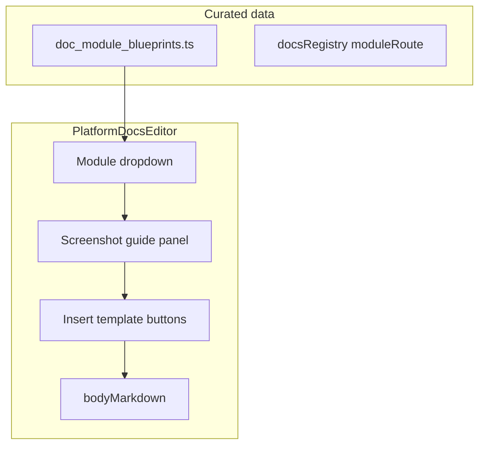

# Plan: Module-guided documentation workflow

> **Status (removed):** The **Guide from module** UI (`PlatformDocsModuleGuidePanel`), blueprint query param (`?blueprint=`), **`lib/docs/doc-module-blueprints.ts`**, and related editor actions (**Insert outline template**, screenshot slot placeholders, **Fill from module guide**) were **removed from the product**. This file is kept as historical context only.

This document described the platform documentation editor workflow: pick a module from the app, see screenshot guidance, and insert structured markdown templates.

## Goal

Platform admins should be able to:

1. Pick a **module** from a **dropdown** (aligned to real app routes / product areas).
2. See **where to add screenshots** and **what each shot should show** (clear checklist).
3. **Insert** starter markdown (headings + placeholders) for that module into the editor body.

This is **guided authoring**, not automatic extraction from React source. Parsing every `page.tsx` into docs is fragile; a **curated blueprint manifest** next to nav/registry is reviewable in PRs.

### Suggested implementation todos (summary)

Work in this order; the full checklist with file links is in [Suggested implementation todos](#suggested-implementation-todos) below.

| # | Todo id | What |
|---|---------|------|
| 1 | `blueprint-data` | Types + `DOC_MODULE_BLUEPRINTS` + helpers in `lib/docs/doc-module-blueprints.ts` |
| 2 | `blueprint-seed` | Seed registry + CTMS (and optional eTMF/platform) blueprints |
| 3 | `editor-module-ui` | Dropdown, route/source hints, screenshot guide panel in `PlatformDocsEditor` |
| 4 | `editor-insert-actions` | Insert outline + per-slot image placeholders |
| 5 | `preview-comments` | (Optional) Strip HTML comments in Preview only |
| 6 | `platform-admin-docs` | Update `docs/PLATFORM_ADMIN.md` for blueprint maintenance |
| 7 | `QA` | Acceptance criteria pass |

## Architecture

## New data: `lib/docs/doc-module-blueprints.ts`

Add a new module with:

| Field | Purpose |
|--------|--------|
| `id` | Stable value for the select |
| `label` | Dropdown label |
| `primaryRoute` | Where to go in the app while capturing (e.g. `/protected/ae`) |
| `relatedSlug` | Optional `docsRegistry` slug when the manual maps 1:1 |
| `sourceHint` | Optional: e.g. `app/protected/ae/page.tsx` for writers describing behavior |
| `outlineTemplate` | Multiline markdown (sections / `##` blocks) |
| `screenshotSlots` | Ordered `{ id, title, captureInstructions, optionalAnchorHeading? }[]` |

**Screenshot slots** answer “where” and “what”: e.g. “After **Overview**, full-width table with filters open” and “From nav: Custom → Study trackers → AE Metrics”.

### v1 seeding

- Registry entries that already set `moduleRoute` in [`lib/docs/registry.ts`](lib/docs/registry.ts).
- Important CTMS areas from `ctmsNavItems` in [`components/ctms/top-navbar.tsx`](components/ctms/top-navbar.tsx) (Studies, Sites, Trip Reports, etc.) even if there is no doc slug yet.

Helpers: e.g. `getBlueprintById(id)`, export `DOC_MODULE_BLUEPRINTS`.

## UI: [`components/platform/platform-docs-editor.tsx`](components/platform/platform-docs-editor.tsx)

Inside the existing layout (under title or before slug):

1. **Select “Guide from module”** — options from blueprints plus “None / freeform”.
2. When a module is selected:
   - **Row:** link or copy for `primaryRoute`; optional monospace `sourceHint`.
   - **Screenshot guide:** ordered list or accordion from `screenshotSlots`.
3. **Buttons:**
   - **Insert outline template** — append (with separator) or replace-with-confirm if body is non-empty.
   - **Insert placeholder** per slot — e.g. `` and/or `<!-- Screenshot: … -->` above it.

Preserve existing behavior: slug, title, category, Write/Preview tabs, screenshot upload, save.

## Preview / markdown

If HTML comments are used for author notes, optionally strip them in preview (small helper on the string passed to `react-markdown` in preview only).

## Out of scope (v1)

Items deliberately **not** in the first release:

| Area | Excluded in v1 | Notes |
|------|----------------|--------|
| Capture | Automatic / in-browser screenshots | No Playwright, Puppeteer, or extension-driven capture; authors use OS screenshot + existing upload or external URL. |
| Content generation | LLM or static analysis of React/TS | No “read all `page.tsx` and write docs”; blueprints are hand-curated. |
| Code intelligence | Full AST or dependency graph of modules | No automated sync from file tree; optional `sourceHint` strings only. |
| Product data | Per-tenant or dynamic module lists from DB | Dropdown is from static `DOC_MODULE_BLUEPRINTS` (plus optional merge with `docsRegistry`), not live company flags. |
| Assets | Orphan cleanup, asset library UI, versioning | No deletion of storage objects when markdown changes; no screenshot history. |
| i18n | Translated blueprint labels or templates | English-only v1 unless extended later. |

**Still in scope for v1:** curated blueprints, editor UI, insert template / placeholders, link to `primaryRoute`, screenshot slot checklist.

## Documentation maintenance

Update [`docs/PLATFORM_ADMIN.md`](docs/PLATFORM_ADMIN.md) with a short note: when routes or nav change, update `doc-module-blueprints.ts`.

## Suggested implementation todos

Use these as a checklist when implementing (order is recommended):

- [x] **blueprint-data** — Add [`lib/docs/doc-module-blueprints.ts`](lib/docs/doc-module-blueprints.ts): TypeScript types (`DocModuleBlueprint`, `ScreenshotSlot`), exported `DOC_MODULE_BLUEPRINTS` array, `getBlueprintById(id)`, optional `getBlueprintsForSelect()` sorted by label.
- [x] **blueprint-seed** — Seed v1 entries: all `docsRegistry` rows with `moduleRoute`, plus priority CTMS routes from [`components/ctms/top-navbar.tsx`](components/ctms/top-navbar.tsx) `ctmsNavItems` (and optionally eTMF / platform-only routes if desired).
- [x] **editor-module-ui** — In [`components/platform/platform-docs-editor.tsx`](components/platform/platform-docs-editor.tsx): state for selected blueprint; `Select` (or Combobox) “Guide from module” + “None”; panel with route link, copy URL, `sourceHint`; ordered screenshot guide from `screenshotSlots`.
- [x] **editor-insert-actions** — Buttons: “Insert outline” (append vs replace-with-confirm when body non-empty); per-slot “Insert placeholder” appending `` and/or HTML comment with instructions.
- [x] **preview-comments** — Optional: strip `<!-- ... -->` in Preview tab only so author notes do not clutter [`DocsViewer`](components/docs/docs-viewer.tsx) output.
- [x] **platform-admin-docs** — Extend [`docs/PLATFORM_ADMIN.md`](docs/PLATFORM_ADMIN.md): blueprint file location, when to update it, relation to `docsRegistry.moduleRoute`.
- [x] **QA** — Verify acceptance criteria (dropdown, ≥2 slots for a seeded module, insert updates body, Preview OK, primary route opens).

## Acceptance criteria

- Dropdown lists seeded modules; choosing one shows at least two screenshot slots with concrete instructions.
- Insert outline / placeholders updates `bodyMarkdown`; Preview reflects content (comments handled as chosen).
- Primary route is easy to open in another tab while capturing.
