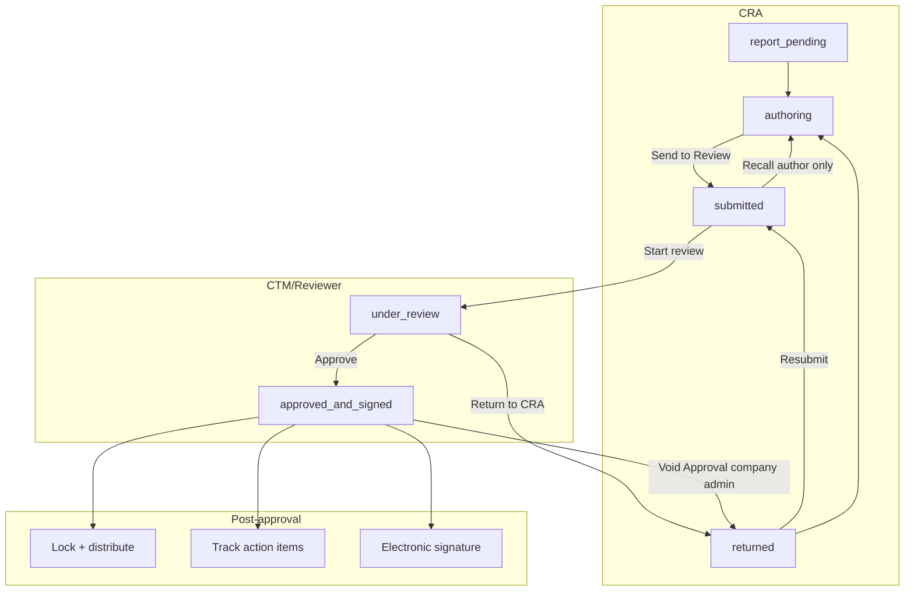

# Report Submission and Approval Workflow

## Role-based access (CRA / CPM)

| Capability | Who |
|------------|-----|
| Create visit + report, draft, submit, resubmit from returned, recall while submitted, void as author | **CRA** — active `study_team_members` on the visit’s `study_id` with `role = clinical_research_associate`. |
| Start review, assign reviewer, save reviewer comments, return, approve, void as approver | **CPM** — `role = clinical_project_manager` on that study. |
| View in-flight report | **CRA or CPM** on the study, or company **admin** (`profiles.role`), per app checks and `trip_reports` RLS. |
| View approved report | **Anyone in the company** that owns the study (`report_status = approved_and_signed'`). |

**Product rules (locked):**

- **Monitors are CRAs for permissions**: Do not use `monitoring_visits.monitor_id` as a permission source; authorization is **`study_team_members`** with `clinical_research_associate` / `clinical_project_manager` only.
- **Study is always required**: Every `monitoring_visits` row must have `study_id`; role checks use that id.
- **No custom-role mapping**: Admins cannot map “custom” study team roles to CRA/CPM for reports—only the standard enum values qualify.

**Implementation notes:**

- Server helpers: `lib/visit-report-permissions.ts`. Delegation: `assignReportReviewer` (CPM only; assignee must be CPM on study). Reviewer actions allow **assigned reviewer OR any CPM** on the study.
- **Audit**: `trip_report_status_events` (append-only; written from server actions via service role).
- **Email**: submit → CPMs (+ assigned reviewer if set); return → author; approve → author + CPMs; assignment → assignee (`lib/trip-report-notifications.ts`, Resend).
- **UI**: Trip Reports **Review queue** tab (CPM); summary/tracker **Edit** / **Open for review** gated by `can_edit_report` / `can_review_report`; **View report** uses `can_view_report` (aligned with `canViewTripReportContent`); **official PDF** is generated on demand via the same `VisitReportPdfData` / `@react-pdf/renderer` pipeline as authoring (`getApprovedTripReportPdfData` + `downloadVisitReportPdf`), exposed from the summary and tracker **Report options** column (document icon and **Download official PDF** menu item) when `report_status === 'approved_and_signed'`; SLA badges for submission/approval overdue.
- **Dev workflow test**: `transitionReportStatusForTest` requires `NODE_ENV=development` **and** `TRIP_REPORT_WORKFLOW_TEST_BYPASS=true`.

---

## Current State

**What exists:**
- Status flow: `report_pending` → `authoring` → `submitted` → `under_review` → `returned` → `approved_and_signed`
- **Submit**: CRA clicks "Send to Review" → `submitReport` sets `report_status: 'submitted'`, `submitted_date`
- Schema: `trip_reports` has `reviewer_id`, `reviewed_at`, `approved_by`, `approved_date`; `trip_report_question_responses` has `reviewer_comments`
- Templates: `days_submission`, `days_approval` for due-date calculation
- Action items: `trip_report_action_items` (open/closed) per report
- Authoring UI: CRA edits questions, narrative, attendees, CRFs, action items

**What is missing:**
- No transition from `submitted` to `under_review`
- No "Return to CRA" or "Approve" actions
- No reviewer/CTM UI (review queue, add comments, Return/Approve buttons)
- CRA can edit `reviewer_comments` (should be reviewer-only)
- No lock on approved reports (currently canEdit is `report_pending` or `authoring` only, but approved lock not explicit)
- No distribution mechanism; no dedicated action-item tracking view
- No electronic signature capture on approval

---

## Target Workflow

---

## Implementation Plan

### Phase 1: Server Actions and Status Transitions

**1.1 Add new actions in `lib/actions/visit-reports.ts`**

- **`startReview(reportId)`**: `submitted` → `under_review`; set `reviewer_id` = current user, `reviewed_at` = now
- **`returnReport(reportId, responsesWithReviewerComments?)`**: `under_review` → `returned`; persist `reviewer_comments` on question responses if provided
- **`approveReport(reportId)`**: `under_review` → `approved_and_signed`; set `approved_by`, `approved_date`; optionally set `reviewer_id`/`reviewed_at` if not already set

**1.2 Update `submitReport`**

- Optionally auto-assign `under_review` if a "claim on submit" behavior is desired, or keep `submitted` and require reviewer to explicitly start review. **Recommendation**: Keep `submitted`; reviewer clicks "Start review" to move to `under_review`.

**1.3 Add action to save reviewer comments without returning**

- **`saveReviewerComments(reportId, responses[])`**: Allow reviewer to save `reviewer_comments` on question responses while in `under_review` (so they can add comments incrementally before returning or approving).

### Phase 2: Permissions and Role Checks

**2.1 Reviewer identification**

- Option A: All users in company can review (simplest)
- Option B: Add `reviewer` role or `can_review_reports` flag on profiles/company
- Option C: Designate reviewer per study/site via existing CTM/role models

**Recommendation**: Start with Option A; add role-based checks later if needed.

**2.2 Restrict `reviewer_comments` editing**

- In `visit-report-authoring.tsx`: Only allow editing `reviewer_comments` when current user is the assigned reviewer (or has review permission) and status is `under_review`. CRAs see reviewer comments as read-only.

### Phase 3: Reviewer UI

**3.1 Review queue / dashboard**

- Add a "Review" or "My reviews" section to `trip-reports-page-client.tsx` or a dedicated `/protected/trip-reports/review` tab
- List reports with `report_status in ('submitted', 'under_review')` assigned to current user (or unassigned)
- Allow "Start review" on `submitted` reports

**3.2 Review mode in authoring page**

- Reuse `visit-report-authoring.tsx` for reviewer view
- When `report_status` is `under_review` and current user is reviewer:
  - Show "Return to CRA" and "Approve" buttons in sidebar/footer
  - Enable editing of `reviewer_comments` only (questions/response remain read-only or with limited edit)
  - "Return to CRA" → call `returnReport`, optionally with current `reviewer_comments`
  - "Approve" → call `approveReport`

**3.3 CRA view when returned**

- When `report_status` is `returned`, CRA can edit questions/comments again and resubmit
- Resubmit: `returned` → `submitted` (same as submitReport but from `returned`)

**3.4 Recall workflow**

- When `report_status` is `submitted`, the report author can **Recall** to withdraw the submission before review starts
- Recall: `submitted` → `authoring`; clears `submitted_date`; only the author (`created_by`) can recall

**3.5 Void approval workflow**

- When `report_status` is `approved_and_signed`, a **company administrator** (`profiles.role = 'admin'`) can **Void Approval** to return the report for corrections (e.g., discovered error post-approval)
- Void: `approved_and_signed` → `returned`; clears `approved_by`, `approved_date`, `approval_signature_data`, `approval_signed_at`
- Requires a **written reason** (minimum length enforced server-side), **password re-verification** (`signInWithPassword` for the signed-in user’s email), and a confirmation dialog
- Audit: `trip_report_status_events.metadata` stores `{ void_approval: true, reason }` for the transition; the audit note shows a truncated reason

### Phase 4: Lock and Audit

**4.1 Lock approved reports**

- When `report_status === 'approved_and_signed'`:
  - No edits to questions, narrative, attendees, etc.
  - Read-only authoring view; hide Save Draft, Send to Review, reviewer actions
  - PDF export remains available

**4.2 Audit trail (optional enhancement)**

- Log status transitions (submitted_at, reviewed_at, approved_at) for compliance; schema already supports dates.

### Phase 5: Electronic Signature Capture

**5.1 Schema changes**

- Add to `trip_reports` (or new `visit_report_signatures` table):
  - `approval_signature_data` TEXT or JSONB – stores signature image/data (e.g., base64 PNG, SVG path)
  - `approval_signed_at` TIMESTAMPTZ – timestamp when signature was captured
  - `approval_signed_by` UUID – references profiles (redundant with `approved_by` but explicit for signature)

**5.2 Signature capture flow**

- When reviewer clicks "Approve", show a signature modal/dialog before final approval:
  - Canvas or signature-pad component for drawing
  - "Typed name" fallback (name + checkbox "I attest that…") for accessibility
  - "Clear" and "Confirm" buttons
- On confirm: capture signature data, call `approveReport(reportId, { signatureData, signedAt })`
- Persist signature with approval record

**5.3 Display and audit**

- Include signature image/typed name in PDF export (approval section)
- Show signature in report detail view when approved
- Store in audit-friendly format (immutable once approved)

**5.4 Technical options**

- **Client-side**: Use `react-signature-canvas` or similar; export as base64 PNG
- **Storage**: Store in `trip_reports.approval_signature_data` or separate `visit_report_signatures` table with `trip_report_id` FK
- **Compliance**: Consider 21 CFR Part 11 if applicable (electronic records/signatures); may need additional controls (e.g., no backspace after sign, timestamp, user attestation)

### Phase 6: Distribution and Action Items

**6.1 Distribution**

- **Minimal**: Approved reports appear in list; stakeholders can open and download PDF
- **Extended**: Optional "Share" or "Notify" action that sends link/PDF to a configurable list (email integration). Defer to later phase if not critical.

**6.2 Action item tracking**

- Existing `trip_report_action_items` already support open/closed
- Add a view or filter: "Open action items" across reports (or per report) so CTMs can track resolution
- Consider linking to existing `action_items` table if company uses a global action-item system

---

## Files to Change

| File | Changes |
|------|---------|
| `lib/actions/visit-reports.ts` | Add `startReview`, `returnReport`, `approveReport`, `saveReviewerComments`, `recallReport`, `voidApproval`; update `submitReport` to allow resubmit from `returned`; extend `approveReport` for signature capture |
| `components/ctms/trip-reports/visit-report-authoring.tsx` | Reviewer mode: Return/Approve buttons; restrict `reviewer_comments` to reviewer; lock approved; handle resubmit from `returned`; integrate signature modal before Approve; Recall button (submitted) and Void Approval button (approved) with confirmation dialog |
| `components/ctms/trip-reports/trip-reports-page-client.tsx` | Add review queue / "Reports to Review" section; "Start review" action |
| `components/ctms/trip-reports/visit-report-pdf-document.tsx` | Render approval signature in PDF |
| `app/protected/trip-reports/` | Optional: dedicated review page or tab |
| **New**: `components/ctms/trip-reports/signature-capture-modal.tsx` | Signature pad + typed name fallback; used before Approve |
| **Migration**: `supabase/migrations/` | Add `approval_signature_data`, `approval_signed_at` (and optionally `approval_signed_by`) to `trip_reports` |

---

## Status Transition Matrix

| From | To | Trigger |
|------|-----|---------|
| authoring | submitted | CRA: Send to Review |
| submitted | under_review | Reviewer: Start review |
| submitted | authoring | CRA (author): Recall |
| under_review | returned | Reviewer: Return to CRA |
| returned | submitted | CRA: Resubmit (same as Send to Review) |
| under_review | approved_and_signed | Reviewer: Approve (+ signature capture) |
| approved_and_signed | returned | Company admin: Void Approval (reason + password) |

---

## Out of Scope (Future)

- Multi-step approval (e.g., CTM then Medical Monitor)
- Deeper integration with global action-items
- Distribution automation (email PDF to stakeholders)
