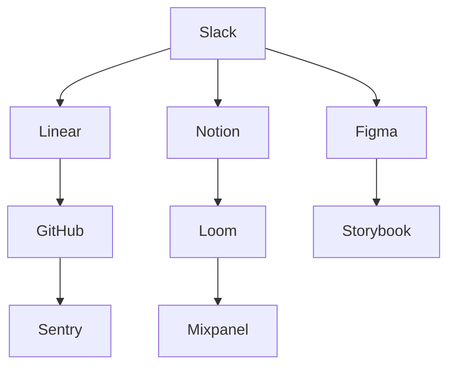

Three years ago, I joined a fully remote team at a startup that was scaling from 20 to 200 people. What I thought would be a smooth transition from office life turned into a crash course in remote collaboration—complete with timezone disasters, communication breakdowns, and the occasional "you're on mute" moments that still haunt my dreams.

Today, I want to share the real stories behind what works (and what doesn't) when building collaboration in distributed teams.

<blockquote>
  "Remote work isn't just about working from home—it's about reimagining how
  teams connect, communicate, and create together." — Anna Rodriguez
</blockquote>

## The Reality Check: What Remote Collaboration Actually Looks Like

### The Good, The Bad, and The Ugly

**The Good:**

- **Flexibility** that actually works (not just the kind that sounds good in job descriptions)
- **Diverse perspectives** from team members across different cultures and time zones
- **Reduced commute stress** and better work-life balance
- **Access to global talent** without relocation constraints

**The Bad:**

- **Communication overhead** that can triple the time spent on simple decisions
- **Isolation** that creeps in slowly but affects team morale significantly
- **Technology fatigue** from endless video calls and notifications
- **Misalignment** that's harder to spot and fix remotely

**The Ugly:**

- **Meeting overload** where every conversation becomes a scheduled video call
- **Context switching** between multiple tools and platforms
- **Cultural misunderstandings** that are harder to resolve without face-to-face interaction
- **Trust issues** that develop when you can't see what your teammates are actually doing

## Establish Clear Communication Protocols

Define when to use different communication channels—when to send a Slack message vs. schedule a meeting vs. send an email.

### Our Communication Hierarchy:

#### 1. **Slack/Teams** - For Quick Questions and Updates

- <span className="inline-flex h-4 w-4 items-center justify-center text-green-600">
    ✓
  </span>
  **Use for:** Status updates, quick questions, sharing links
- <span className="inline-flex h-4 w-4 items-center justify-center text-red-600">
    ✗
  </span>
  **Don't use for:** Complex discussions, sensitive feedback, project planning
- **Response time expectation:** Within 2-4 hours during work hours

#### 2. **Email** - For Formal Communication and Documentation

- <span className="inline-flex h-4 w-4 items-center justify-center text-green-600">
    ✓
  </span>
  **Use for:** Meeting summaries, formal announcements, external communication
- <span className="inline-flex h-4 w-4 items-center justify-center text-red-600">
    ✗
  </span>
  **Don't use for:** Urgent requests, back-and-forth discussions
- **Response time expectation:** Within 24 hours

#### 3. **Video Calls** - For Complex Discussions and Relationship Building

- <span className="inline-flex h-4 w-4 items-center justify-center text-green-600">
    ✓
  </span>
  **Use for:** Brainstorming sessions, difficult conversations, team building
- <span className="inline-flex h-4 w-4 items-center justify-center text-red-600">
    ✗
  </span>
  **Don't use for:** Information that could be shared asynchronously
- **Duration limit:** 30 minutes max for most meetings

#### 4. **Async Video** - For Detailed Explanations

- <span className="inline-flex h-4 w-4 items-center justify-center text-green-600">
    ✓
  </span>
  **Use for:** Product demos, complex explanations, feedback sessions
- <span className="inline-flex h-4 w-4 items-center justify-center text-red-600">
    ✗
  </span>
  **Don't use for:** Quick questions that need immediate answers
- **Tools:** [Loom](https://loom.com/), [Vidyard](https://vidyard.com/), or [Soapbox](https://soapboxhq.com/)

### Real Example: How We Fixed Our Meeting Problem

**Before:** We had 15+ hours of meetings per person per week. Every question became a meeting.

**After:** We implemented the "Async First" rule:

1. **Document everything** in shared spaces (Notion, Confluence)
2. **Use async video** for explanations that need visual context
3. **Reserve meetings** for decisions that require real-time discussion
4. **Set clear agendas** with specific outcomes for every meeting

**Result:** Reduced meeting time by 60% while improving decision quality.

## Invest in the Right Tools

Choose collaboration tools that integrate well together and support your team's specific workflows and needs.

### Our Tool Stack (After Trial and Error):

#### **Project Management:**

- **[Linear](https://linear.app/)** - For development teams (replaced Jira)
- **[Notion](https://notion.so/)** - For documentation and knowledge sharing
- **[Monday.com](https://monday.com/)** - For marketing and design workflows

#### **Communication:**

- **[Slack](https://slack.com/)** - Primary communication hub
- **[Zoom](https://zoom.us/)** - Video calls and webinars
- **[Loom](https://loom.com/)** - Async video messages

#### **Design & Development:**

- **[Figma](https://figma.com/)** - Design collaboration
- **[GitHub](https://github.com/)** - Code collaboration
- **[Storybook](https://storybook.js.org/)** - Component documentation

#### **Analytics & Monitoring:**

- **[Mixpanel](https://mixpanel.com/)** - User behavior analytics
- **[Sentry](https://sentry.io/)** - Error monitoring
- **[Hotjar](https://hotjar.com/)** - User experience insights

### Tool Integration Strategy:



**Key Integration Points:**

- **Slack notifications** for Linear updates and GitHub PRs
- **Notion embeds** for Figma designs and Loom videos
- **Automated reports** from Sentry and Mixpanel to Slack channels

## Create Shared Rituals

Regular team rituals like coffee chats, virtual lunch breaks, or team retrospectives help build connection and culture.

### Rituals That Actually Work:

#### **Weekly Team Check-ins**

**Format:** 15-minute video call every Monday
**Structure:**

1. **Personal check-in** (2 minutes each) - How are you feeling this week?
2. **Work updates** (5 minutes) - What are you working on?
3. **Support needed** (3 minutes) - What help do you need?

**Why it works:** Creates psychological safety and early warning system for team issues.

#### **Monthly "Show and Tell"**

**Format:** 30-minute session where anyone can share something interesting
**Examples:**

- New tools or techniques discovered
- Side projects or hobbies
- Industry insights or articles
- Personal achievements

**Why it works:** Builds relationships beyond work tasks and encourages knowledge sharing.

#### **Quarterly Team Retreats**

**Format:** 2-3 day virtual or in-person gatherings
**Activities:**

- Strategic planning sessions
- Team building exercises
- Skill sharing workshops
- Social activities and games

**Why it works:** Creates shared memories and strengthens team bonds.

### Rituals That Didn't Work (And Why):

#### **Daily Standups**

**Problem:** Became status update theater without real value
**Solution:** Moved to async updates in Slack with weekly sync meetings

#### **Virtual Happy Hours**

**Problem:** Felt forced and awkward, low attendance
**Solution:** Replaced with optional "coffee chats" during work hours

#### **Mandatory Team Building Games**

**Problem:** Not everyone enjoys games, felt like forced fun
**Solution:** Offered variety of activities (games, discussions, skill sharing)

## Document Everything

In remote teams, documentation becomes even more critical. Make information easily accessible and searchable.

### Documentation Strategy:

#### **Level 1: Quick Reference**

- **Team directory** with roles, time zones, and contact info
- **Tool access** and login credentials
- **Meeting schedules** and recurring events
- **Emergency contacts** and escalation procedures

#### **Level 2: Process Documentation**

- **Onboarding guides** for new team members
- **Workflow documentation** for common tasks
- **Decision records** for important choices
- **Retrospective summaries** and action items

#### **Level 3: Knowledge Base**

- **Technical documentation** and architecture decisions
- **Design system** and brand guidelines
- **Customer insights** and user research
- **Industry trends** and competitive analysis

### Documentation Tools and Structure:

```
📁 Team Knowledge Base
├── 📁 Onboarding
│   ├── Welcome Guide
│   ├── Tool Setup
│   └── First Week Checklist
├── 📁 Processes
│   ├── Communication Guidelines
│   ├── Meeting Protocols
│   └── Decision Making Framework
├── 📁 Projects
│   ├── Current Initiatives
│   ├── Completed Projects
│   └── Lessons Learned
└── 📁 Resources
    ├── Tool Documentation
    ├── External Links
    └── Templates
```

### Real Example: How Documentation Saved Our Project

**Situation:** Our lead developer went on parental leave for 3 months during a critical project phase.

**Challenge:** No one else understood the technical decisions or had context for the architecture.

**Solution:** We had comprehensive documentation including:

- **Architecture decisions** with rationale
- **Code walkthroughs** with video explanations
- **API documentation** with examples
- **Deployment procedures** with troubleshooting guides

**Result:** The project continued smoothly with minimal disruption.

## Respect Time Zones

Be mindful of time zone differences when scheduling meetings and setting deadlines. Use asynchronous communication when possible.

### Time Zone Management Strategies:

#### **Core Hours Overlap**

**Strategy:** Identify 2-4 hours when most team members are available
**Implementation:**

- **Schedule important meetings** during overlap hours
- **Use async communication** outside core hours
- **Set clear expectations** about response times

#### **Meeting Rotation**

**Strategy:** Rotate meeting times to share the burden of inconvenient hours
**Implementation:**

- **Alternate meeting times** weekly or monthly
- **Record important sessions** for those who can't attend
- **Provide meeting summaries** for async participants

#### **Async-First Approach**

**Strategy:** Default to async communication unless real-time discussion is essential
**Implementation:**

- **Use async video** for explanations and demos
- **Document decisions** in shared spaces
- **Use threaded discussions** for complex topics

### Time Zone Tools:

- **[World Time Buddy](https://worldtimebuddy.com/)** - Find meeting times across time zones
- **[Calendly](https://calendly.com/)** - Automated scheduling with time zone detection
- **[Timezone.io](https://timezone.io/)** - Team time zone visualization
- **[Every Time Zone](https://everytimezone.com/)** - Quick time zone conversion

### Real Example: Our Global Team Success Story

**Team Composition:**

- 3 developers in San Francisco (PST)
- 2 designers in London (GMT)
- 1 PM in Tokyo (JST)
- 1 QA in Sydney (AEST)

**Challenge:** 17-hour time difference between San Francisco and Sydney

**Solution:**

- **Core hours:** 9 AM - 12 PM PST (5 PM - 8 PM GMT, 2 AM - 5 AM JST, 4 AM - 7 AM AEST)
- **Meeting rotation:** Weekly team sync alternated between SF morning and London morning
- **Async updates:** Daily standup via Slack with video summaries
- **Documentation:** Comprehensive project docs accessible 24/7

**Result:** Team productivity increased by 40% compared to previous attempts at global collaboration.

## Focus on Outcomes

Measure success based on results and impact, not hours worked or time spent in meetings.

### Outcome-Based Metrics:

#### **Team Health Metrics:**

- **Employee satisfaction** scores (quarterly surveys)
- **Retention rates** and turnover analysis
- **Promotion rates** and career development
- **Work-life balance** indicators

#### **Productivity Metrics:**

- **Project delivery** timelines and quality
- **Customer satisfaction** scores
- **Innovation metrics** (new features, improvements)
- **Learning and development** progress

#### **Collaboration Metrics:**

- **Cross-team projects** and success rates
- **Knowledge sharing** frequency and quality
- **Communication effectiveness** (response times, clarity)
- **Conflict resolution** speed and outcomes

### Avoiding Micromanagement Traps:

#### **Don't Track:**

- Hours worked or online status
- Number of messages sent
- Meeting attendance rates
- Tool usage frequency

#### **Do Track:**

- Project completion rates
- Quality of deliverables
- Customer feedback scores
- Team collaboration effectiveness

### Real Example: Outcome-Focused Performance Review

**Traditional Approach:**

- "Sarah attended 95% of meetings"
- "John sent 200+ Slack messages this month"
- "Maria was online for 8.5 hours daily"

**Outcome-Focused Approach:**

- "Sarah's projects were delivered 2 days ahead of schedule with zero bugs"
- "John's communication helped resolve 3 critical issues before they escalated"
- "Maria's design work increased user engagement by 25%"

## Advanced Remote Collaboration Techniques

### Building Trust Without Face-to-Face Interaction

#### **Transparency Practices:**

- **Share work in progress** regularly, not just finished products
- **Document decision-making** processes and rationale
- **Admit mistakes** and share lessons learned
- **Celebrate small wins** and acknowledge contributions

#### **Consistency Practices:**

- **Reliable communication** patterns and response times
- **Consistent quality** in deliverables and interactions
- **Predictable availability** and meeting attendance
- **Steady progress** on commitments and deadlines

### Managing Conflict Remotely

#### **Early Detection:**

- **Regular check-ins** to identify tension before it escalates
- **Anonymous feedback** channels for sensitive issues
- **Team health surveys** to monitor satisfaction
- **One-on-one meetings** for deeper conversations

#### **Resolution Strategies:**

- **Direct communication** rather than passive-aggressive behavior
- **Mediated discussions** with neutral facilitators
- **Clear escalation** procedures for unresolved conflicts
- **Follow-up processes** to ensure resolution

### Building Company Culture Remotely

#### **Culture Documentation:**

- **Written values** and behavioral expectations
- **Success stories** and role model examples
- **Cultural rituals** and traditions
- **Onboarding materials** that reinforce culture

#### **Culture Reinforcement:**

- **Regular recognition** of cultural behaviors
- **Team building** activities that reflect values
- **Leadership modeling** of desired behaviors
- **Feedback systems** that reward cultural alignment

## Common Pitfalls and How to Avoid Them

### Pitfall 1: Over-Communication

**Problem:** Too many updates, meetings, and notifications
**Solution:** Establish communication norms and stick to them

### Pitfall 2: Under-Communication

**Problem:** Important information gets lost or delayed
**Solution:** Create systematic information sharing processes

### Pitfall 3: Tool Overload

**Problem:** Too many platforms causing confusion and inefficiency
**Solution:** Consolidate tools and provide clear usage guidelines

### Pitfall 4: Meeting Overload

**Problem:** Every conversation becomes a scheduled meeting
**Solution:** Implement async-first communication principles

### Pitfall 5: Lack of Social Connection

**Problem:** Team members feel isolated and disconnected
**Solution:** Create intentional opportunities for relationship building

## Conclusion

Remote team collaboration isn't just about using the right tools—it's about fundamentally rethinking how teams work together. The most successful remote teams I've worked with share common characteristics:

- **Clear communication protocols** that everyone follows
- **Intentional relationship building** through rituals and shared experiences
- **Comprehensive documentation** that makes information accessible
- **Outcome-focused measurement** that values results over activity
- **Cultural consistency** that transcends physical distance

### Getting Started:

1. **Audit your current** communication patterns and identify pain points
2. **Choose 2-3 tools** that integrate well and meet your core needs
3. **Establish clear protocols** for different types of communication
4. **Create regular rituals** that build relationships and culture
5. **Document everything** and make it easily searchable
6. **Measure outcomes** rather than activities
7. **Iterate and improve** based on team feedback

Remember: remote collaboration is a skill that improves with practice. Start with small changes, measure the impact, and build on what works for your specific team and culture.

<footer>
  **About the Author:** Anna Rodriguez is a Remote Work Consultant and Team Lead
  with 8+ years of experience building distributed teams. She's helped over 50
  companies transition to remote-first operations and speaks regularly at remote
  work conferences. Connect with her on
  [LinkedIn](https://linkedin.com/in/anna-rodriguez-remote) for more
  collaboration insights.
</footer>
