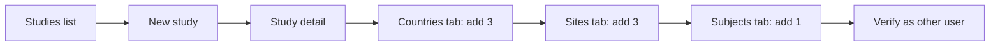

# User Acceptance Test Script — CTMS Study Setup (Study, Countries, Sites, Subject)

**Module:** Clinical Trial Management System (CTMS)  
**Primary routes:** `/protected/studies`, study detail `/protected/studies/{studyId}`  
**Legacy alias:** `/protected/clinical-trials` redirects to `/protected/studies`  
**Date prepared:** 2026-03-24

---

## Security note (credentials)

Do **not** store production or shared passwords in this repository. For UAT execution, keep account credentials in your team’s password manager or a private runbook. The tables below use **persona labels** only; testers sign in with the accounts your administrator provisioned for UAT.

---

## Roles and personas

| Persona | In-app meaning | How it maps in this app |
| --- | --- | --- |
| **Reggie Walton** — Clinical Project Manager (“admin”) | Company-level administrator | `profiles.role = 'admin'` (sees **Close Study** on study detail; full company CTMS data) |
| **Hunter Love** — Clinical Research Associate (“user”) | Standard company user | `profiles.role = 'user'` (same company CTMS scope; no **Close Study**) |

**Study team vs profile role:** Trip reports and some workflows use **study team** roles (`clinical_project_manager`, `clinical_research_associate`, …) on the **Team** tab. This script focuses on study/country/site/subject setup, which is governed by **company** access to CTMS and RLS on `studies` / related tables. Optional step: after creating the study, Reggie adds Hunter on **Team** with role **Clinical Research Associate** so CRA-specific features can be tested later.

---

## Prerequisites

| # | Prerequisite | Details |
| --- | --- | --- |
| P1 | CTMS enabled | Company has `has_ctms_access` enabled; user is not blocked by `requireCtmsAccess` |
| P2 | Same company | Both personas belong to the **same** `company_id` so they see the same studies |
| P3 | Authenticated sessions | Each tester can sign in via `/auth/login` |
| P4 | Browser | Current Chrome, Edge, Firefox, or Safari |

---

## Shared test data (record in execution log)

Use a unique protocol number per run to avoid `23505` duplicate errors (e.g. `UAT-2026-001`, `UAT-2026-002`, …).

| Artifact | Suggested value | Notes |
| --- | --- | --- |
| Study title | `UAT Multinational Feasibility` | Human-readable |
| Protocol number | `UAT-2026-XXX` | Must be unique per company |
| Phase | e.g. `phase_ii` | Match UI options |
| Status | e.g. `planning` or `draft` | Match UI |
| Country 1 | United States (`US`) | From country picker |
| Country 2 | Germany (`DE`) | Distinct from country 1 |
| Country 3 | Japan (`JP`) | Distinct from 1 & 2 |
| Site 1 | Site number `101`, name e.g. `UAT Site — US East` | Link to **US** study country when saving |
| Site 2 | Site number `102`, name e.g. `UAT Site — US West` | Same or different country per design |
| Site 3 | Site number `201`, name e.g. `UAT Site — Berlin` | Link to **DE** (or JP) study country |
| Subject | Subject number `UAT-SUB-001` | **Site** = one of the three sites (required) |
| Subject status | e.g. `pre_screening` or `screening` | Per dialog defaults |

---

## Flow overview

**Order constraint:** Sites can reference `study_country_id`; add **countries before** sites if you assign each site to a country in the site form.

---

## Part A — Clinical Project Manager (admin): Reggie Walton

| Step | Action | Expected result | Pass / Fail | Notes |
| --- | --- | --- | --- | --- |
| A1 | Sign out (if needed), sign in as Reggie | Lands on app home; CTMS areas reachable | | |
| A2 | Open **Studies** (`/protected/studies`) or use top nav **Studies** | Studies page loads; table or empty state | | |
| A3 | Click **New Study** (or equivalent) → `/protected/studies/new` | Create form visible | | |
| A4 | Complete required fields (title, protocol number, phase, …) and save | Success toast or redirect to `/protected/studies/{id}` | | |
| A5 | On study detail, open **Countries** tab | Countries tab shows count; **Add** control available | | |
| A6 | Add country 1 (code + status + regulatory status) | Row appears; success feedback | | |
| A7 | Add country 2 | Two countries listed | | |
| A8 | Add country 3 | Three countries listed; tab badge shows `(3)` after refresh | | |
| A9 | Open **Sites** tab → **Add Site** | Navigates to `/protected/sites/new?studyId=...` | | |
| A10 | Create site 1 with site number, name, optional address; set **study country** to match country 1 | Returns to study or sites list; site visible on **Sites** tab | | |
| A11 | Create site 2 | Two sites on study | | |
| A12 | Create site 3 | Three sites on study | | |
| A13 | Open **Subjects** tab → **Add** (or **Enroll**) | Subject dialog opens; **Site** dropdown lists the three sites | | |
| A14 | Enter subject number, pick a site, set status, save | Success; Subjects tab shows 1 subject; funnel updates if shown | | |
| A15 | **Overview** tab | **Countries** = 3, **Sites** = 3 in timeline/metrics | | |
| A16 | (Optional) **Team** tab → invite or add **Hunter Love** as **Clinical Research Associate** | Member appears active | | For downstream CRA-only tests |

---

## Part B — Clinical Research Associate (user): Hunter Love

| Step | Action | Expected result | Pass / Fail | Notes |
| --- | --- | --- | --- | --- |
| B1 | Sign out, sign in as Hunter | Home loads; CTMS available if company has access | | |
| B2 | Open **Studies**, find the study by title or protocol number | Row visible; same study Reggie created | | |
| B3 | Open study detail | Overview shows correct protocol number and title | | |
| B4 | **Countries** tab | Exactly **3** countries; names/codes match Part A | | |
| B5 | **Sites** tab | **3** sites; site numbers and names match | | |
| B6 | **Subjects** tab | **1** subject; site linkage correct | | |
| B7 | Confirm **Close Study** is **not** shown (admin-only) | Button absent for `user` profile | | Compare with Reggie’s session |

---

## Part C — Regression and legacy URL

| Step | Action | Expected result | Pass / Fail |
| --- | --- | --- | --- |
| C1 | While signed in, open `/protected/clinical-trials` | Redirects to `/protected/studies` | |
| C2 | From Clinical Payments demo quick nav, open **View Studies** | Opens `/protected/studies` | |

---

## Negative / edge checks (optional)

| # | Case | Expected |
| --- | --- | --- |
| N1 | Duplicate protocol number on create | Clear error (e.g. protocol already exists) |
| N2 | Add subject with **no sites** | Cannot complete (site required); UI explains |
| N3 | Add same country twice | Prevented or error (unique country per study) |

---

## Defect logging

For each failure, capture: step id, role, URL, screenshot, browser console errors, and Supabase/network error text if shown. Link to `lib/actions/studies.ts`, `lib/actions/countries.ts`, `lib/actions/sites.ts`, `lib/actions/subjects.ts` for developer triage.

---

## Implementation reference (for authors / devs)

| Area | Key files |
| --- | --- |
| Study CRUD | `app/protected/studies/*`, `components/ctms/studies/*`, `lib/actions/studies.ts` |
| Tabs | `components/ctms/studies/study-detail-tabs.tsx` |
| Countries | `components/ctms/countries/countries-tab.tsx`, `lib/actions/countries.ts` |
| Sites | `components/ctms/sites/sites-tab.tsx`, `components/ctms/sites/site-form.tsx`, `lib/actions/sites.ts` |
| Subjects | `components/ctms/subjects/subjects-tab.tsx`, `subject-form-dialog.tsx`, `lib/actions/subjects.ts` |
| CTMS gate | `lib/server/require-ctms-access.ts` |
| RLS | `supabase/migrations/20260314000000_ctms_core.sql`, `20260315200000_subjects_visits_milestones.sql` |
